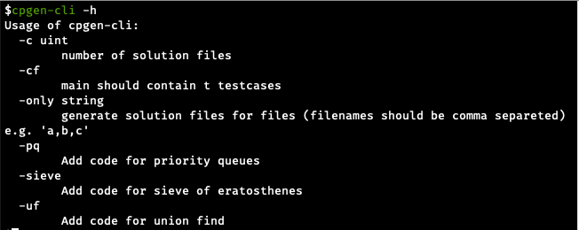
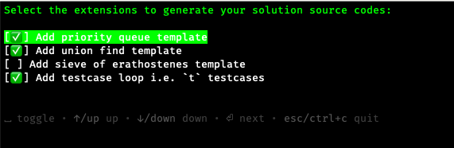
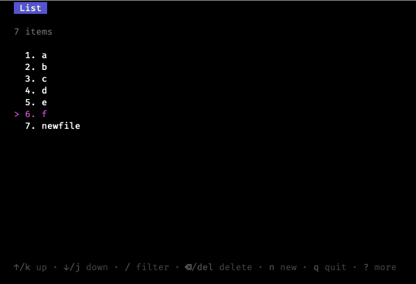
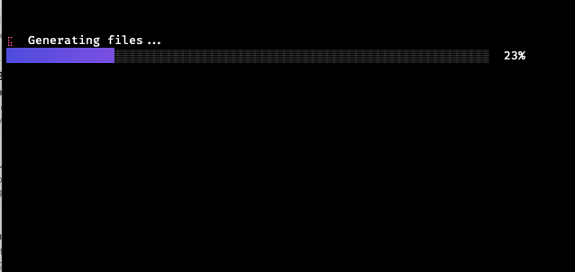

# cpgen 
A terminal based application that generates competitive programming solution files with templates and configurations.

## Table of Contents
- [Installation](#Installation)
- [Usage](#Usage)
- [Contributing](#Contributing)
- [Screenshots](#Screenshots)
- [License](#License)

## Installation
### Prerequisites
- [>= Go 1.18](https://go.dev/)

Download the source code and run the following `make` commands to install the program in the `GOBIN` directory.
```bash
make install-cli # cli version
# OR
make install-tui # terminal UI version
```
## Usage
### CLI
- Make sure the binary has been installed.
- When using CLI version, options can be passed with flags. Run `cpgen-cli -h` to view options.
### TUI
- Make sure the binary has been installed.
- Run `cpgen`

## Contributing
- Fork the repository.
- Create a new branch.
- Make changes and commit.
### Roadmap
- [ ] Add support for other competitive programming websites  
- [ ] Add more templates

---
Don't forget to star 🌟 the repository if you found this useful. Thanks ❤️

## Screenshots
### CLI


### TUI
#### option screen

#### files screen

#### loading screen

